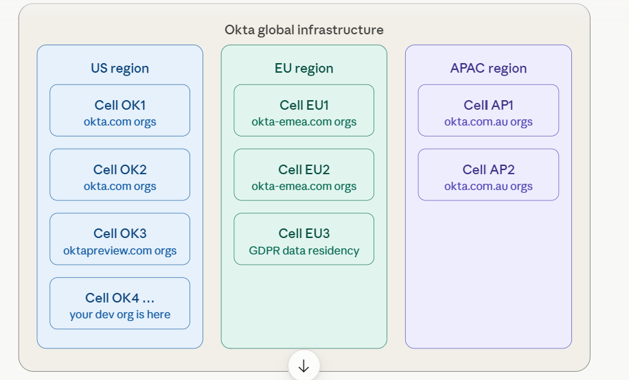

# Okta:

There are 3 pillers of Okta,

1. Workforce Identity Cloud (WF) - employees, contracters, partners
2. Customer Identity - External partners or users to access your app
3. Customer Identity CLoud (CIAM) - A Developer friendly SDK

## Pillers if Okta

### Workforce Identity Cloud:

The most classic and important placem where most of the okta admin will spend their time. It is the place weher we will resolving all okta problmes, by providing single sign in for all enterprise apps, enforce MFA, SCIM lifecycle, LDAP/AD integrations etc  

### Customer Identity

CIS is Okta's solution for when your own company's app needs to authenticate external users — customers, patients, citizens. Instead of building login pages, password reset flows, and MFA from scratch, you embed Okta's Sign-In Widget or use hosted login pages. Your app delegates all auth to Okta.

### Customer Identity Cloud

Okta acquired Auth0 in 2021. Auth0 targets software developers building consumer-facing apps (B2C). It's highly developer-friendly with SDKs for every language, a rich Rules/Actions engine, and a flexible tenant model. While CIS is admin-configured, Auth0 is code-configured.

## Org and Tiers

Org in okta is the dedicated tenant - company's dedicated isolated okta environment with its own URL. So the corresponding organization can manage its own users, configurations etc.

1. developer.okta.com -> Free, highly used by developers
2. my-company.okta-com -> Production apps, where okta gives the dedicated environment to yoru company. This will hold all the identity and access for the users / emplyees.
3. my-company.oktapreview.com -> dedicated environment t test and validate the new feature provided by okta
4. company-sandbox.okta.com -> a Dedicated environment (QA) to validate the auth features

## Okta Cell structure:

A infrastructure which was backed by AWS. Here there will be list of Cells.

- Each cell has its own database, services and infrastructure, so that there wont be any single poit of failure.
- Each cell in each regions, can be its own infrastructure and Org

